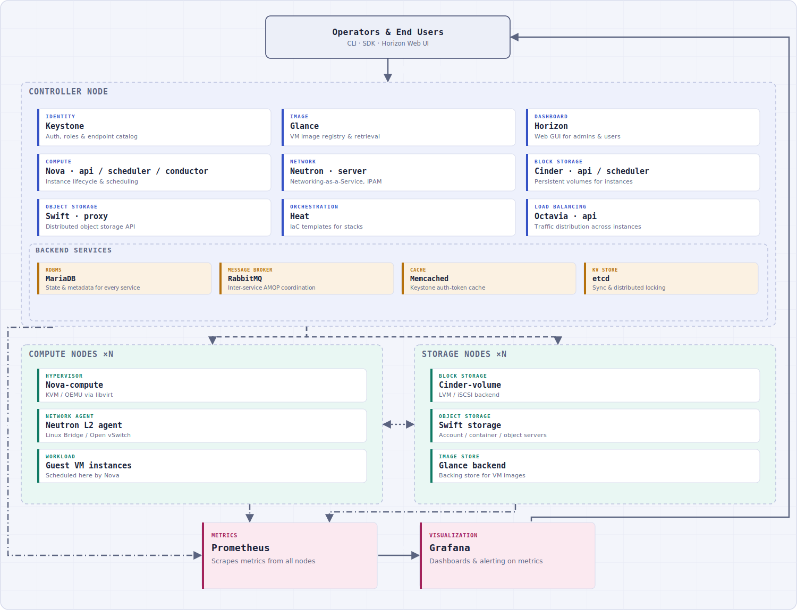

# Private_Cloud_OpenStack
## 🏗️ System Architecture

Below is the deployment model of the system, including the Controller, Compute/Storage nodes, Backend Services (MariaDB, RabbitMQ, Memcached, etcd), OpenStack Core Services (Nova, Neutron, Keystone, Glance, Cinder, Swift, Heat), and the monitoring/alerting system (Prometheus/Grafana):

  

**Legend**
- Dashed box → physical/logical node boundary (Controller / Compute / Storage)
- Blue chip → OpenStack core service · Amber chip → backend/infrastructure service · Green chip → compute/storage node service · Pink chip → monitoring
- Solid line → synchronous REST/HTTPS API · Dashed line → AMQP messaging (RabbitMQ) · Dotted line → data-plane traffic (volume attach, image transfer) · Dash-dot line → metrics scrape (Prometheus)

---

## 🎥 Project Demo Video

To watch the detailed, real-world operation of the system, please access the Google Drive folder via the link below:

👉 **[Watch the System Demo Video here](https://drive.google.com/drive/folders/1zf7uFeplftviIn-IQP_doIUMNhrzWo9w?usp=drive_link)**

---

## 🛠️ Overview of Technologies & OpenStack Services

To provide a clearer understanding of the architecture shown above, here is a brief introduction to the backend services and core components used in this project:

### 1. Backend Services
These components form the operational backbone of the OpenStack Controller, ensuring communication, data consistency, and state management:
- **RabbitMQ:** The message broker responsible for inter-service communication. OpenStack services use it to send updates and coordinate tasks.
- **MariaDB:** The relational database management system (RDBMS) where all OpenStack services store their state, configuration, and metadata.
- **Memcached:** A distributed memory caching system used to store authentication tokens (from Keystone) to reduce database load and improve response times.
- **etcd:** A distributed key-value store used primarily by OpenStack components (like networking mechanisms or coordination helpers) for synchronization and distributed locking.

### 2. OpenStack Core Services
- **Keystone (Identity Service):** The central authentication and authorization service. It tracks users, roles, and provides a catalog of available endpoints for all other services.
- **Glance (Image Service):** Manages Virtual Machine (VM) disk images. It allows users to discover, register, and retrieve template images used to spin up instances.
- **Nova (Compute Service):** The heart of OpenStack cloud computing. It manages the lifecycle of instances (creation, scheduling, and decommissioning) across the Compute nodes.
- **Neutron (Networking Service):** Provides Network-Connectivity-as-a-Service between interface devices managed by other OpenStack services (like Nova). It handles IP allocation, routing, and switching.
- **Cinder (Block Storage):** Provides persistent block storage volumes to Nova virtual machines, allowing data to persist even if the VM instance is destroyed.
- **Swift (Object Storage):** A highly available, distributed, and scalable object storage system. Perfect for storing unstructured data like VM images or backups.
- **Heat (Orchestration Service):** Allows developers to automate the deployment of cloud infrastructure using human-readable templates (Infrastructure as Code - IaC).
- **Octavia (Load Balancer Service):** Delivers scalable, on-demand load balancing capabilities to manage traffic distribution across instances.
- **Horizon (Dashboard):** The web-based graphical user interface (GUI) that allows administrators and users to interact with OpenStack resources easily.

### 3. Monitoring & Observability Stack
- **Prometheus:** A powerful metrics aggregator that scrapes performance data from the Controller, Compute, and Storage nodes.
- **Grafana:** The visualization platform that connects to Prometheus to display real-time graphs, resource utilization dashboards, and system health status.

---

## ⚙️ Reference Configuration Files (2026.1 / Ubuntu)

The [`configs/`](configs/) directory holds reference configuration files transcribed verbatim from the official [OpenStack 2026.1 Installation Guide](https://docs.openstack.org/2026.1/install/) (Ubuntu flavor), matching the components described above. Every file's header comment cites its exact source URL and notes related install steps (SQL/CLI commands, package installs) shown alongside it in the guide.

> ⚠️ **All passwords, secrets, and placeholder values** (e.g. `KEYSTONE_DBPASS`, `RABBIT_PASS`, `METADATA_SECRET`, `NEUTRON_PASS`, IP addresses like `10.0.0.11`) **must be replaced with real values** before any of this is used in an actual deployment.

| Folder | Service | Files |
|---|---|---|
| [`configs/backend/`](configs/backend/) | MariaDB, RabbitMQ, Memcached, etcd | `mariadb.cnf`, `rabbitmq.md`, `memcached.conf`, `etcd.conf` |
| [`configs/keystone/`](configs/keystone/) | Identity | `keystone.conf` |
| [`configs/glance/`](configs/glance/) | Image | `glance-api.conf` |
| [`configs/nova/`](configs/nova/) | Compute | `nova-controller.conf`, `nova-compute.conf` |
| [`configs/neutron/`](configs/neutron/) | Networking (self-service, Open vSwitch) | `neutron-controller.conf`, `neutron-compute.conf`, `ml2_conf.ini`, `openvswitch_agent.ini`, `dhcp_agent.ini`, `metadata_agent.ini`, `l3_agent.md` |
| [`configs/cinder/`](configs/cinder/) | Block Storage | `cinder-controller.conf`, `cinder-storage.conf` |
| [`configs/swift/`](configs/swift/) | Object Storage | `proxy-server.conf`, `account-server.conf`, `container-server.conf`, `object-server.conf`, `swift.conf`, `rings-setup.md` |
| [`configs/heat/`](configs/heat/) | Orchestration | `heat.conf` |
| [`configs/octavia/`](configs/octavia/) | Load Balancer | `octavia.conf` |
| [`configs/horizon/`](configs/horizon/) | Dashboard | `local_settings.py` |

---

## 📚 References
- [OpenStack Component Services](https://www.openstack.org/software/project-navigator/openstack-components#openstack-services)
- [OpenStack Installation Guide (2026.1)](https://docs.openstack.org/2026.1/install/)
