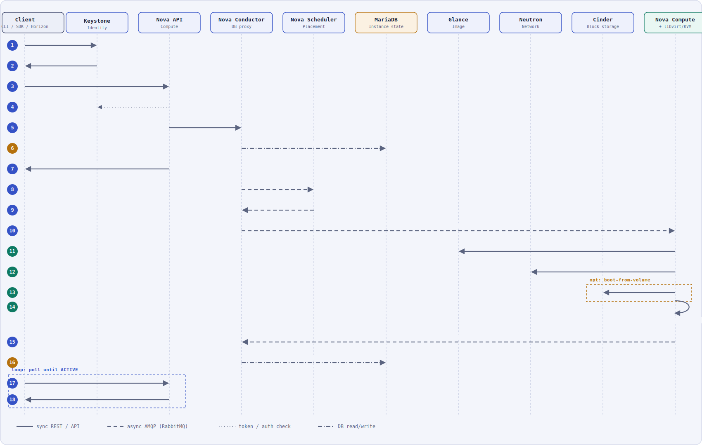

# Scenario 1 — Create a Virtual Machine

This document details the request flow triggered when a user asks OpenStack to launch a new instance (`openstack server create`, `nova boot`, or the Horizon *Launch Instance* button). It is the first of four operational-scenario diagrams for this project (see the [README](../../README.md#-operational-workflows) for the full list).

  

**Legend** (same convention as the [architecture diagram](../../README.md#%EF%B8%8F-system-architecture)): solid = synchronous REST/API call · dashed = async AMQP messaging via RabbitMQ · dotted = token/auth check · dash-dot = MariaDB read/write.

## Step-by-step

1. **Client → Keystone** — the user (via CLI/SDK or Horizon) requests an auth token, presenting credentials (or an existing token to re-scope to a project).
2. **Keystone → Client** — Keystone validates the credentials and returns a scoped token (`X-Auth-Token`), which Keystone also stores so it can be validated later without re-checking credentials; a copy is cached in **Memcached** to speed up future validations.
3. **Client → Nova API** — `POST /v2.1/{project_id}/servers` with the token plus the instance spec: image reference, flavor, network(s), key-pair, and optional user-data.
4. **Nova API → Keystone** — the token is validated (token introspection). In practice this usually hits the **Memcached** token cache first and only falls back to Keystone on a cache miss.
5. **Nova API → Nova Conductor** — once authorized, Nova API hands the build request to `nova-conductor`, which is the only component allowed to touch the database directly (API and compute nodes never talk to MariaDB themselves).
6. **Nova Conductor → MariaDB** — inserts the new instance row with state `BUILDING` and a freshly generated UUID.
7. **Nova API → Client** — returns `202 Accepted` immediately with the instance UUID and state `BUILDING`. Everything from this point on happens **asynchronously**; the client is expected to poll for status (steps 17–18).
8. **Nova Conductor → Nova Scheduler** *(via RabbitMQ)* — asks the scheduler to pick a compute host, passing the flavor's resource requirements (vCPU, RAM, disk) and any filters/weights (availability zone, affinity rules, etc.).
9. **Nova Scheduler → Nova Conductor** *(via RabbitMQ)* — returns the chosen compute host.
10. **Nova Conductor → Nova Compute** *(via RabbitMQ)* — dispatches `build_and_run_instance` to the `nova-compute` service running on the selected host.
11. **Nova Compute → Glance** — fetches the VM image (or its metadata/location, depending on the image backend) referenced in the request.
12. **Nova Compute → Neutron** — requests network resources: a port is created/bound, an IP is allocated (DHCP), and security groups are applied.
13. **Nova Compute → Cinder** *(optional — `opt` box)* — only when the instance boots from a volume, or extra volumes were requested, Nova asks Cinder to create/attach the block device.
14. **Nova Compute → libvirt/KVM** *(self-call, same host)* — defines and starts the guest domain, attaching the image/volume and the network port prepared in the previous steps.
15. **Nova Compute → Nova Conductor** *(via RabbitMQ)* — reports the outcome (success/failure, assigned IP, host details) back to the conductor.
16. **Nova Conductor → MariaDB** — updates the instance row to state `ACTIVE` (or `ERROR` on failure).
17. **Client → Nova API** *(loop)* — the client polls `GET /servers/{id}` at intervals until the instance leaves the `BUILDING` state.
18. **Nova API → Client** — returns `200 OK` with state `ACTIVE` and the instance's assigned IP address, completing the flow.

## Notes

- **RabbitMQ** carries every hop between Nova API/Conductor, the Scheduler, and Nova Compute (steps 8–10, 15) — this is why the API can answer step 7 immediately while provisioning continues in the background.
- **Keystone + Memcached** gate every inter-service call in this diagram, not just steps 1–4; they are omitted from steps 5–18 only to keep the diagram readable.
- The **Cinder** step is conditional: a plain image-backed instance skips it entirely and boots straight onto the compute node's local/ephemeral disk.
- This flow assumes a single-region, single-cell deployment matching the [System Architecture](../../README.md#-system-architecture) described in the main README.
