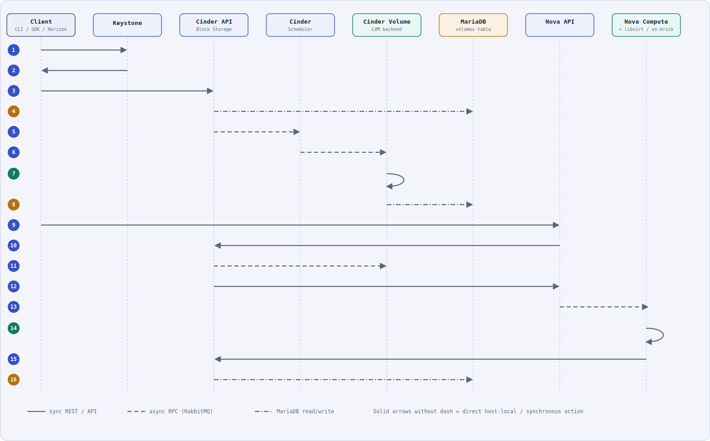
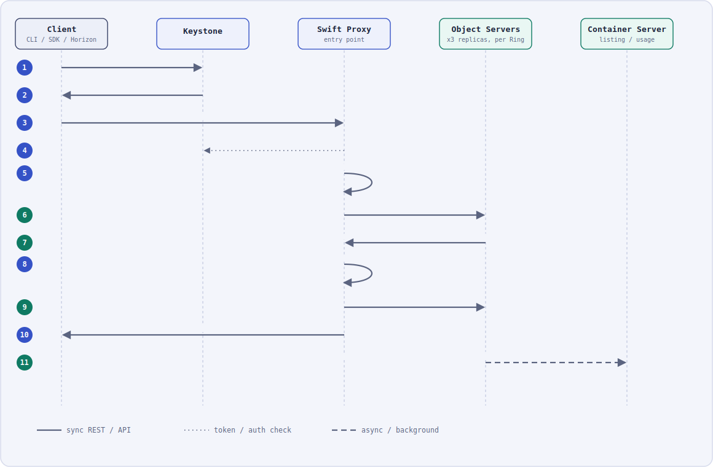
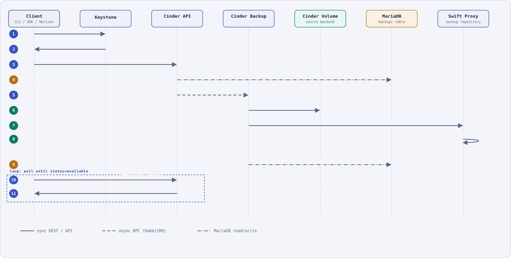

# Scenario 2 — Storage Operations

This document covers three storage-related request flows in one scenario, as grounded in the official OpenStack **2026.1** documentation:

1. [Create a volume and attach it to a running instance](#1-create-a-volume-and-attach-it-to-an-instance) (Cinder)
2. [Upload an object into OpenStack](#2-upload-an-object) (Swift)
3. [Back up a volume using Object Storage as the repository](#3-back-up-a-volume-to-swift) (Cinder Backup → Swift)

**Legend** (same convention used across all workflow diagrams in this project): solid = synchronous REST/API call · dashed = async RPC via RabbitMQ · dotted = token/auth check · dash-dot = database read/write.

Sources consulted:
- [Cinder — System Architecture](https://docs.openstack.org/cinder/2026.1/contributor/architecture.html)
- [Cinder — Manage volumes](https://docs.openstack.org/cinder/2026.1/admin/blockstorage-manage-volumes.html)
- [Cinder — Volume backups](https://docs.openstack.org/cinder/2026.1/admin/blockstorage-volume-backups.html)
- [Swift — Overview / Architecture](https://docs.openstack.org/swift/2026.1/overview_architecture.html)

---

## 1. Create a Volume and Attach It to an Instance

  

Per Cinder's documented architecture, **cinder-api**, **cinder-scheduler**, **cinder-volume** and **cinder-backup** all share one central SQL database directly (there is no separate conductor layer in Cinder, unlike Nova) and talk to each other over RPC (the queue) or HTTP.

1. **Client → Keystone** — request an auth token.
2. **Keystone → Client** — return the scoped token.
3. **Client → Cinder API** — `openstack volume create` → `POST /volumes`.
4. **Cinder API → MariaDB** — inserts the new volume row directly, status `creating`.
5. **Cinder API → Cinder Scheduler** *(RPC)* — asks the scheduler which host/backend should own the volume.
6. **Cinder Scheduler → Cinder Volume** *(RPC cast)* — the scheduler casts the create request straight to the chosen `cinder-volume` service.
7. **Cinder Volume → LVM backend** *(self action)* — for the LVM driver used in this deployment, `openstack volume create` "creates an LV into the volume group (VG) `cinder-volumes`."
8. **Cinder Volume → MariaDB** — updates the volume status to `available`.
9. **Client → Nova API** — `openstack server add volume` (attach request).
10. **Nova API → Cinder API** — reserves the volume and requests `initialize_connection`.
11. **Cinder API → Cinder Volume** *(RPC)* — creates the export; per the docs this "creates a unique IQN that is exposed to the compute node."
12. **Cinder API → Nova API** — returns the connection info (iSCSI IQN, target portal, LUN).
13. **Nova API → Nova Compute** *(RPC)* — dispatches the attach job to the instance's host.
14. **Nova Compute → os-brick/libvirt** *(self action)* — the compute node "now has an active iSCSI session and new local storage (usually a `/dev/sdX` disk)"; libvirt then attaches it to the domain, and "the instance gets a new disk (usually a `/dev/vdX` disk)."
15. **Nova Compute → Cinder API** — reports the attachment complete.
16. **Cinder API → MariaDB** — updates the volume status to `in-use`.

---

## 2. Upload an Object

  

Swift's architecture doc describes the **Proxy Server** as the component "responsible for tying together the rest of the Swift architecture" — it is the only party the client ever talks to.

1. **Client → Keystone** — request an auth token.
2. **Keystone → Client** — return the scoped token.
3. **Client → Swift Proxy** — `PUT /v1/AUTH_<account>/<container>/<object>`, streamed.
4. **Swift Proxy → Keystone** — validates the token (auth middleware).
5. **Swift Proxy (self)** — consults the **Ring**, which provides "a mapping between the names of entities stored on disk and their physical location," to resolve the partition and the set of object-server replicas responsible for it.
6. **Swift Proxy → Object Servers (×3)** — the proxy "does not spool" the upload; it **streams the data directly** to the designated object servers in parallel.
7. **Object Servers → Swift Proxy** — each stores the object "as binary files on the filesystem with metadata stored in the file's extended attributes (xattrs)" and acknowledges.
8. **Swift Proxy (self)** — waits for a quorum of successful replica writes before considering the PUT successful.
9. **Swift Proxy → Container Server** — updates the container listing (object count and storage usage for that container).
10. **Swift Proxy → Client** — `201 Created`.
11. **(background)** — the **replicator** process reconciles any inconsistent replicas afterward, pushing updates via rsync or HTTP.

> If a target object server is unreachable during step 6, the proxy "will ask the ring for a handoff server and route there instead" instead of failing the request.

---

## 3. Back Up a Volume to Swift

  

Per the Cinder admin guide, **"by default, the Swift object store is used for the backup repository,"** and the backup data is chunked according to two configuration options: `backup_swift_block_size` (default 32,768 bytes — the granularity incremental backups track changes at) and `backup_swift_object_size` (default 52,428,800 bytes ≈ 50 MB — the size of each object Cinder writes into Swift).

1. **Client → Keystone** — request an auth token.
2. **Keystone → Client** — return the scoped token.
3. **Client → Cinder API** — `openstack volume backup create [--incremental] [--force] VOLUME` → `POST /backups`.
4. **Cinder API → MariaDB** — inserts the backup record and flips the source volume's status to `backing-up`.
5. **Cinder API → Cinder Backup** *(RPC)* — dispatches the backup job.
6. **Cinder Backup → Cinder Volume (source)** — reads the volume data in `backup_swift_block_size` chunks; for an **incremental** backup, only the blocks changed since the parent backup are read.
7. **Cinder Backup → Swift Proxy** — `PUT`s the data as a series of `backup_swift_object_size`-sized objects into the configured Swift backup container.
8. **Swift Proxy (self)** — stores those objects the same replicated way as [Flow 2](#2-upload-an-object) above.
9. **Cinder Backup → MariaDB** — marks the backup `available` and returns the source volume to `available`.
10. **Client → Cinder API** *(loop)* — polls the backup status.
11. **Cinder API → Client** — `200 OK`, status `available`.

> Because "volume backups are dependent on the Block Storage database," the docs recommend also backing up the Cinder DB itself — or separately exporting a backup's metadata (**export/import backup metadata**), which removes that DB dependency for restoring that specific backup.
