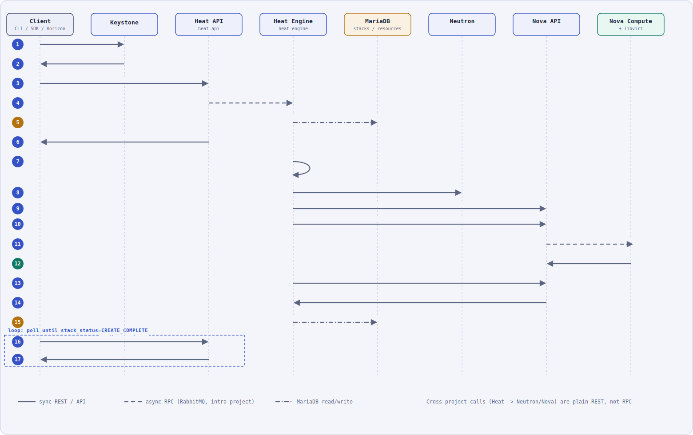

# Scenario 3 — Create VMs in a Stack (Heat Orchestration)

This document details the request flow when a user submits a Heat template that defines one or more `OS::Nova::Server` resources (plus supporting resources like a network/port), grounded in the official OpenStack **2026.1** Heat documentation.

  

**Legend** (same convention as the other workflow diagrams): solid = synchronous REST/API call · dashed = async RPC via RabbitMQ (**intra-project only**) · dash-dot = database read/write.

Sources consulted:
- [Heat — Get started / Architecture](https://docs.openstack.org/heat/2026.1/install/get_started.html)
- [Heat — Glossary](https://docs.openstack.org/heat/2026.1/glossary.html)
- [Heat — HOT template spec](https://docs.openstack.org/heat/2026.1/template_guide/hot_spec.html)
- [Orchestration API reference](https://docs.openstack.org/api-ref/orchestration/v1/index.html)

## Key concepts (as documented)

- A **Stack** is "a collection of instantiated resources that are defined in a single template."
- A **Resource** is "an element of OpenStack infrastructure instantiated from a particular resource provider" — an `OS::Nova::Server` resource is what actually causes a VM to be created.
- A **Template** is "an orchestration document that details everything needed to carry out an orchestration," and Heat provides "template-based orchestration for describing a cloud application by running OpenStack API calls."
- **heat-api** "provides an OpenStack-native REST API that processes API requests by sending them to the heat-engine over RPC."
- **heat-engine**'s "main responsibility is to orchestrate the launching of templates and provide events back to the API consumer" — it is the component that actually calls out to Nova/Neutron/etc.
- Resource ordering is driven by the `depends_on` attribute ("defines a dependency between this resource and one or more other resources") plus the implicit dependencies created by the `get_resource` and `get_attr` intrinsic functions, which reference another resource's ID/attribute and therefore force that resource to be created first.

## Step-by-step

1. **Client → Keystone** — request an auth token.
2. **Keystone → Client** — return the scoped token.
3. **Client → Heat API** — `openstack stack create -t template.yaml my-stack` → `POST /stacks` with the template body and input parameters.
4. **Heat API → Heat Engine** *(RPC)* — heat-api "processes API requests by sending them to the heat-engine over RPC."
5. **Heat Engine → MariaDB** — persists the new stack record, status `CREATE_IN_PROGRESS`.
6. **Heat API → Client** — returns `201 Created` with the stack ID; the stack is still `CREATE_IN_PROGRESS` at this point — everything below happens asynchronously.
7. **Heat Engine (self)** — parses the template and builds the resource **dependency graph** from `depends_on`, `get_resource`, and `get_attr` references (e.g., each server depends on the network/port it plugs into).
8. **Heat Engine → Neutron** — creates the network/port resource(s) the servers depend on, as a plain REST call (Heat acts as an API client here, the same way the CLI or Horizon would).
9. **Heat Engine → Nova API** — creates **Server A** (`OS::Nova::Server`) once its dependencies are satisfied.
10. **Heat Engine → Nova API** — creates **Server B** (`OS::Nova::Server`) in parallel with step 9, since nothing in the template makes one `depends_on` the other.
11. **Nova API → Nova Compute** *(RPC)* — the full Nova boot sequence takes over for both servers here; see [Scenario 1 — Create a Virtual Machine](01-create-instance.md) for the detailed scheduler/conductor/hypervisor steps this compresses.
12. **Nova Compute → Nova API** — both instances reach `ACTIVE`.
13. **Heat Engine → Nova API** — polls the server resources' status (this is how a Heat resource's `check_create_complete` determines whether the underlying resource is done).
14. **Nova API → Heat Engine** — reports `ACTIVE` for each server.
15. **Heat Engine → MariaDB** — marks each resource `CREATE_COMPLETE`; once every resource in the graph is complete, the **stack** itself is marked `CREATE_COMPLETE`.
16. **Client → Heat API** *(loop)* — polls `GET /stacks/{id}` for the stack status.
17. **Heat API → Client** — returns `200 OK`, `stack_status=CREATE_COMPLETE`, plus any template `outputs` (e.g., an instance's IP via `get_attr`).

## Notes

- **Cross-project calls are REST, not RPC.** Heat Engine talking to Neutron/Nova (steps 8–10, 13) is a plain authenticated HTTP call, exactly like the CLI or Horizon would make. RabbitMQ RPC (dashed lines) is only used *within* a project, between its own `-api` and `-engine`/`-conductor` processes (step 4, and internally within Nova per Scenario 1).
- **Parallel resource creation**: Heat only serializes resources that actually depend on each other. Two `OS::Nova::Server` resources with no `depends_on` between them (steps 9–10) are created concurrently, which is exactly how "create N VMs in one stack" scales.
- **Failure handling**: if any resource fails, the stack moves to `CREATE_FAILED`; by default Heat then rolls back by deleting the resources it already created for that stack, unless the template/request disables rollback.
