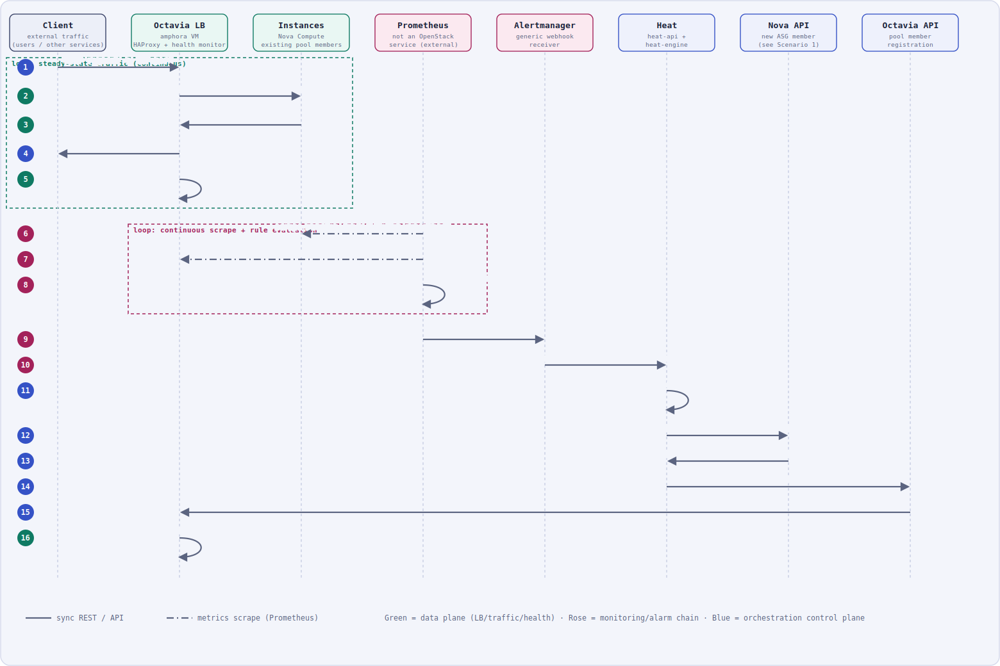
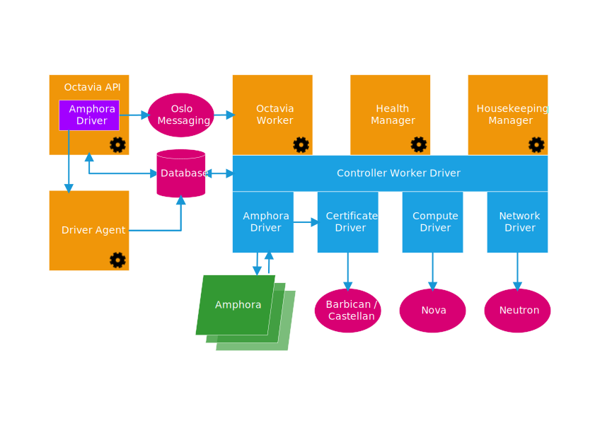

# Scenario 4 — Autoscaling + Load Balancer + Prometheus

This is the most involved scenario: Octavia load-balances traffic across a pool of instances, Prometheus watches the fleet, and a threshold breach triggers Heat to grow (or shrink) the pool automatically.

> **On the Prometheus question:** Prometheus is *not* an OpenStack project and has no page in the OpenStack docs. The "textbook" documented bridge is OpenStack's alarming service **Aodh**, which ships an **`OS::Aodh::PrometheusAlarm`** resource type that queries Prometheus and fires a webhook. **This project deliberately does not use Aodh** — it's an aging component with a heavy, brittle dependency chain (Ceilometer/Gnocchi-era baggage) that isn't worth carrying just to relay a webhook. Instead, this deployment wires **Prometheus's own Alertmanager straight into Heat**: Alertmanager's built-in generic `webhook_configs` receiver POSTs directly to the target `OS::Heat::ScalingPolicy`'s `signal_url`. Heat's signal endpoint is a plain, documented webhook target — it doesn't care who calls it — so this skips Aodh entirely and removes a whole service (and its dependencies) from the critical path. This is the actual, working setup, not a hypothetical.

  

**Legend**: solid = synchronous REST/API call · dash-dot = Prometheus metrics scrape · green = data plane (load balancing / health checks) · rose = monitoring/alerting chain · blue = orchestration control plane (Heat/Nova/Octavia APIs).

Sources consulted:
- [Octavia — Introduction / architecture](https://docs.openstack.org/octavia/2026.1/reference/introduction.html)
- [Octavia — Basic load balancer cookbook](https://docs.openstack.org/octavia/2026.1/user/guides/basic-cookbook.html)
- Heat's resource-signal mechanism (`OS::Heat::ScalingPolicy` / `signal_url`), the same generic webhook endpoint documented for `OS::Aodh::PrometheusAlarm`'s `alarm_actions` — reused here directly from Alertmanager instead
- Scenario 1 (Nova boot) and Scenario 3 (Heat orchestration) docs in this repo, reused here rather than repeated

## Key concepts

- **Octavia's control plane** is 5 daemons: **API Controller** ("takes API requests... ships them off to the controller worker over the Oslo messaging bus"), **Controller Worker** ("performs the actions necessary to fulfill the API request"), **Health Manager** ("monitors individual amphorae... handles failover events"), **Housekeeping Manager** (cleans up stale records, rotates certs), and **Driver Agent**.

  

**Legend**: orange = Octavia control-plane daemons (API, Worker, Health Manager, Housekeeping Manager, Driver Agent) · purple = Amphora Driver (used by the API to talk to amphorae directly, e.g. for cert rotation) · pink = messaging/storage/external services (Oslo Messaging, Database, Barbican/Castellan for TLS certs, Nova, Neutron) · blue = the Controller Worker's driver interfaces (Amphora, Certificate, Compute, Network) · green = the amphora fleet itself.

Source: [Octavia — Introduction / architecture](https://docs.openstack.org/octavia/2026.1/reference/introduction.html) (official OpenStack documentation diagram).

- **Amphorae** are "the individual virtual machines, containers, or bare metal servers that accomplish the delivery of load balancing services" — the reference implementation is "an Ubuntu virtual machine running HAProxy."
- Octavia's data model, in order: **Load Balancer** (the VIP) → **Listener** (protocol/port) → **Pool** (backend group + algorithm, e.g. `ROUND_ROBIN`) → **Members** (`IP:port` of each backend) → **Health Monitor** (periodic backend health checks).
- **No Aodh in this deployment.** Instead: Prometheus evaluates its own alerting rules against the metrics it has scraped, hands firing alerts to **Alertmanager**, and Alertmanager's generic webhook receiver POSTs straight to Heat.
- **`OS::Heat::ScalingPolicy`** exposes a `signal_url` attribute — a plain HTTP endpoint that, when POSTed to, executes the policy's configured adjustment (e.g. `+1`) on an `OS::Heat::AutoScalingGroup`. It doesn't inspect the POST body, which is exactly why any generic webhook caller (Alertmanager included) can drive it with zero custom glue code.

## Step-by-step

### Loop: steady-state traffic (continuous)
1. **Client → Octavia LB** — a request lands on the load balancer's VIP:port.
2. **Octavia LB → Instances** — the amphora's HAProxy forwards it to a pool member per the configured algorithm.
3. **Instances → Octavia LB** — the member responds.
4. **Octavia LB → Client** — the response is relayed back.
5. **Octavia LB (self)** — the Health Manager/monitor periodically checks each pool member and pulls unhealthy ones out of rotation.

### Loop: continuous scrape + rule evaluation
6. **Prometheus → Instances** — scrapes instance-level metrics (node/libvirt exporters), same mechanism as the [System Architecture](../../README.md#-system-architecture) diagram.
7. **Prometheus → Octavia LB** — also scrapes the HAProxy/amphora exporter for LB-level metrics.
8. **Prometheus (self)** — evaluates its alerting rule (e.g. average CPU across the pool) against the threshold, using the metrics it already scraped.

### Trigger chain (scale-out)
9. **Prometheus → Alertmanager** — the rule fires; Prometheus hands the firing alert to Alertmanager.
10. **Alertmanager → Heat** — Alertmanager's generic webhook receiver POSTs directly to the `OS::Heat::ScalingPolicy`'s `signal_url`.
11. **Heat (self)** — the signaled `ScalingPolicy` executes its configured adjustment (e.g., `+1`) on the `OS::Heat::AutoScalingGroup`.
12. **Heat → Nova API** — creates a new group member (a fresh nested-stack instance of the ASG's member template); the full provisioning sequence is the one detailed in [Scenario 1](01-create-instance.md).
13. **Nova API → Heat** — the new instance reaches `ACTIVE` with an assigned IP.
14. **Heat → Octavia API** — the same member template also registers the new instance as an Octavia pool **member** (`IP:port`).
15. **Octavia API → Octavia LB** — the updated pool configuration is pushed down to the amphora.
16. **Octavia LB (self)** — the health monitor checks the new member; once it passes, HAProxy starts including it in the rotation — closing the loop back into step 2.

## Notes

- **Scale-in is the mirror image**, driven by a second Prometheus alerting rule (low-threshold, e.g. average CPU below X%) routed by Alertmanager to a *scale-down* `OS::Heat::ScalingPolicy` (`adjustment = -1`). Heat deletes one ASG member, which removes its Octavia pool-member registration and terminates its Nova instance — the reverse of steps 9-16.
- **Why this is simpler than the Aodh path**: Aodh's `OS::Aodh::PrometheusAlarm` exists precisely so a *pure* OpenStack template doesn't need anything outside the control plane to reach Prometheus — but that means running Aodh (and its dependency chain) just to shuttle a webhook. Since Alertmanager already speaks generic webhooks natively, pointing it at Heat's `signal_url` directly gets the same result with one fewer moving service.
- This scenario composes directly with [Scenario 3](03-heat-stack-create-vms.md): the `AutoScalingGroup`'s member template is exactly the kind of nested Heat stack described there, just with an added Octavia pool-member resource alongside the `OS::Nova::Server`.
